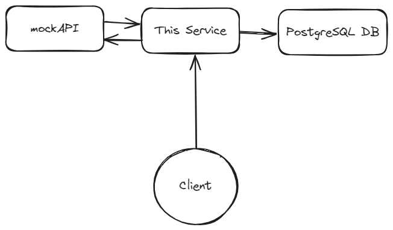

# Money Transfer Service - Brick

This is a Money Transfer service that is able to validate financial account number, transfer/disburse money, and receive a callback when the transaction is completed.

# General Overview



The whole process consists of 3 components:
- This service
- A mock bank/financial service
- PostgreSQL database

The service is responsible for:
- Validating the account number via mockAPI
- Transfer money to the account via mockAPI & insert the transaction data into the database
- Receive a callback from the mockAPI when the transaction is completed and update the data into the database

# Requirements

Required things before running this service:
- Go version 1.22.1 or above
- Docker and Docker Compose installed
- Echo library for HTTP webserver (see [this reference](https://echo.labstack.com/docs/quick-start))
- env package ([installation](https://github.com/caarlos0/env?tab=readme-ov-file#example))
- Gorm & PostgreSQL driver ([installation](https://gorm.io/docs/index.html))

# How to Run

Run this command to copy the env file required to run the service:
```bash
make setup
```

Then, run docker that will start the service & the database:
```bash
make build
make run-docker
```

# Code Explanation

I separated the code into 3 main parts:
- handler, responsible for managing the endpoint, request, and response
- service, responsible for managing the business logic
- repo, communicating with the external service and the database

### Validate Account

The service will validate the account number by calling the mockAPI. The mockAPI will return a response with a status code of 201 if the account number is valid.

Since I'm currently using the free version of mockAPI, I have some limitation with the capability of the endpoint that is being mocked. So, I decided to use POST method that will create a new account number, because this have a similarity with how we validate via an endpoint (sending a POST method and waiting for OK/valid response).

Example request via cURL:
```bash
curl -X POST localhost:8080/account/validate -H "Content-Type: application/json"  -d '{"account_number":50234,"name":"Tjandra"}' -v
```

Example response:
```json
{
  "is_exists": true
}
```

### Transfer/Disburse Money

The service will transfer money to the account number by calling the mockAPI. The mockAPI will return a response with a status code of 201 if the transaction is successful.

This happened in 3 steps:
- Storing the transaction into the DB (with status `PENDING`)
- Calling external service via mockAPI
- Updating the transaction status in the DB (if the response is OK)

I utilized mutex to prevent race condition that coming from 2 different clients in here. Since I assumed that this service will only run on single instance, there is no requirement at the moment to use distributed lock.

Example request via cURL:
```bash
curl -X POST localhost:8080/transactions -H "Content-Type: application/json" -d '{"account_number":500, "amount":5000}' -v
```

Example response:
```json
{
  "is_success": true
}
```

### Receive Callback

This endpoint is supposedly receive a callback from the external service that process our transfer. The external service will send a POST request to this endpoint with the transaction ID and the status of the transaction.

I also utilize mutex in here with the same reasoning as the previous functionality.

Example request via cURL:
```bash
curl -X POST localhost:8080/transactions/2/confirm -H "Content-Type: application/json" -d '{"is_success":true}' -v
```

Example response:
```json
{
  "is_success": true
}
```
